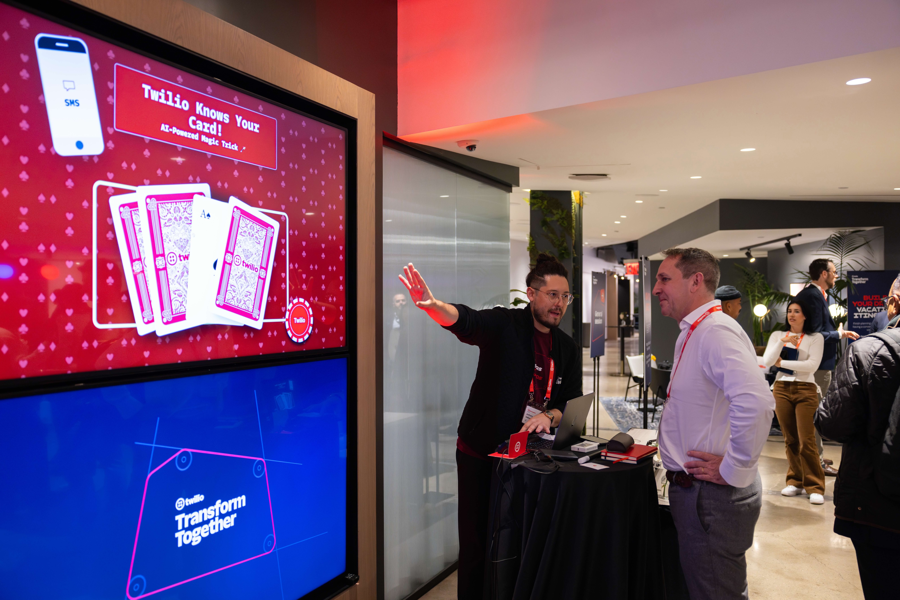
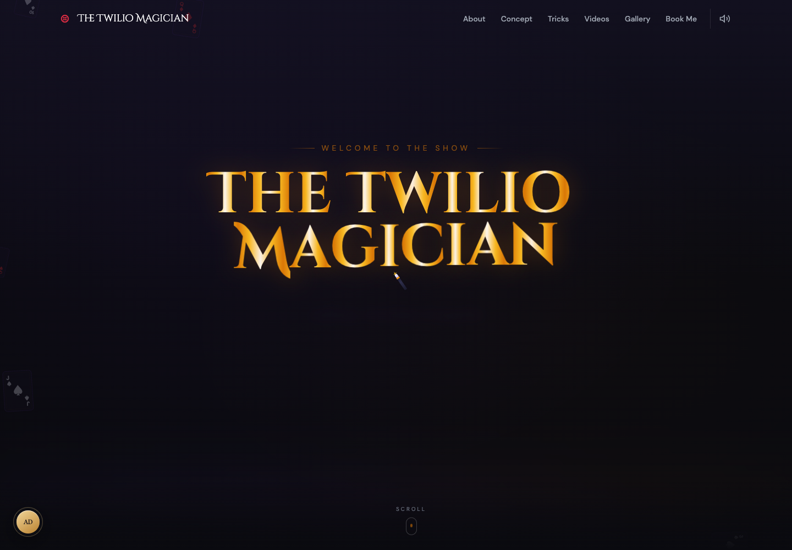
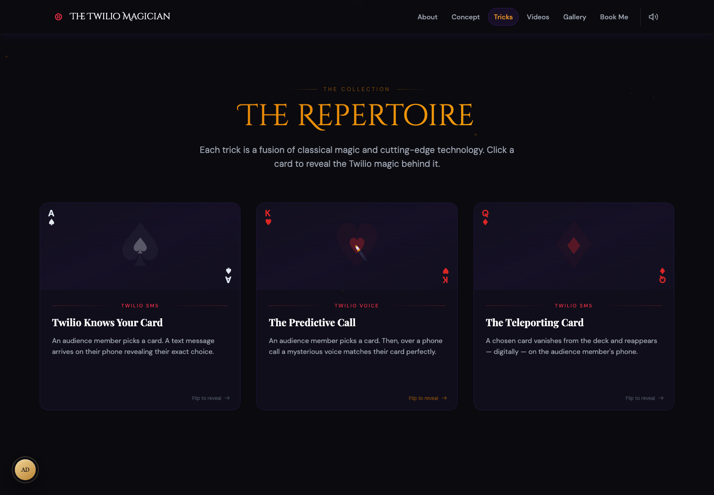
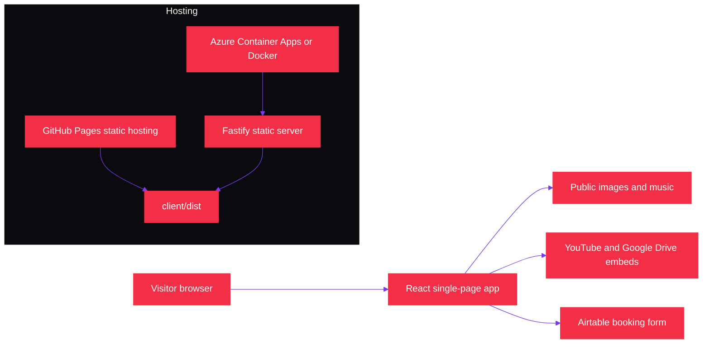

<p align="center">
  
</p>

# The Twilio Magician

[](https://github.com/anthonyjdella/twilio-magician/actions/workflows/ci.yml)
[](https://github.com/anthonyjdella/twilio-magician/actions/workflows/deploy.yml)
[](https://github.com/anthonyjdella/twilio-magician/actions/workflows/deploy-pages.yml)

A magic-themed portfolio website for Anthony Dellavecchia, Developer Evangelist at Twilio. The site presents Twilio-powered performance concepts, videos, gallery content, booking links, and hidden easter eggs through an immersive single-page React experience.

This repository does not call Twilio APIs at runtime and does not require Twilio credentials. Twilio appears in the site content to describe the live magic performances and the products used in those demos.

## In Action

| Preview | Description |
| --- | --- |
|  | **AI-powered card magic.** A live demonstration of **Twilio Knows Your Card**, combining an interactive card reveal with Twilio-powered storytelling. |
|  | **Immersive portfolio experience.** The homepage opens like a stage, combining a cinematic hero, animated cards, particles, and magic-themed navigation. |
|  | **Interactive trick repertoire.** Flip-card experiences connect classic magic effects with Twilio SMS, Voice, and the technology behind each performance. |

## Contents

- [In Action](#in-action)
- [Architecture](#architecture)
- [Tech Stack](#tech-stack)
- [Project Structure](#project-structure)
- [Installation](#installation)
- [Usage](#usage)
- [Configuration](#configuration)
- [Features](#features)
- [Content Management](#content-management)
- [Deployment](#deployment)
- [CI and Dependency Automation](#ci-and-dependency-automation)
- [Known Limitations](#known-limitations)
- [License](#license)

## Architecture



The app can be hosted as static files on GitHub Pages or served by the Fastify server in Docker and Azure Container Apps. The server only serves `client/dist` with an SPA fallback; it does not expose application API routes.

## Tech Stack

| Layer | Technology |
| --- | --- |
| Frontend | React 19, TypeScript, Vite |
| Styling | Tailwind CSS, custom magic/Twilio color palette |
| Animation | GSAP, Framer Motion |
| 3D | Three.js, React Three Fiber, Drei |
| Particles | `@tsparticles/react`, `@tsparticles/slim` |
| Audio | Howler.js |
| Server | Fastify, `@fastify/static`, `@fastify/cors` |
| Package manager | pnpm workspace |
| Deployment | Docker, Azure Container Apps, GitHub Pages, GitHub Actions |

## Project Structure

```text
twilio-magician/
├── client/                  # React frontend built by Vite
│   ├── src/
│   │   ├── components/      # Reusable UI and interactive effects
│   │   ├── sections/        # Page sections such as Hero, About, Tricks, Booking
│   │   ├── hooks/           # Custom React hooks for sound, motion, easter eggs
│   │   ├── three/           # Crystal ball scene and fallback renderer
│   │   ├── utils/           # Asset path helper for static hosting
│   │   └── data/            # Main portfolio content data
│   └── public/
│       ├── images/          # Gallery, portraits, thumbnails, Twilio logo
│       └── sounds/          # Background music
├── server/                  # Fastify static file server
├── scripts/                 # Repository setup helpers
├── .github/workflows/       # CI, Azure deploy, Pages deploy, Dependabot automation
├── Dockerfile               # Multi-stage production image
├── deploy.sh                # Interactive Azure Container Apps deployment script
├── package.json             # Workspace-level scripts
└── pnpm-workspace.yaml      # pnpm workspace definition
```

## Installation

Prerequisites:

| Tool | Version |
| --- | --- |
| Node.js | 20 or newer |
| pnpm | Managed through Corepack; this repo declares `pnpm@10.20.0` |

Install dependencies from the repository root:

```bash
corepack enable
pnpm install
```

## Usage

Start the client and server together in development:

```bash
pnpm dev
```

Development URLs:

| Service | URL | Notes |
| --- | --- | --- |
| Vite client | `http://localhost:5173` | Main development site |
| Fastify server | `http://localhost:3001` | Serves built assets after a build |

Common commands:

| Command | Description |
| --- | --- |
| `pnpm dev` | Run `server` and `client` dev processes concurrently |
| `pnpm build` | Build the client with Vite and compile the server with TypeScript |
| `pnpm start` | Start the compiled Fastify server from `server/dist/index.js` |
| `pnpm --filter client dev` | Run only the Vite development server |
| `pnpm --filter client build` | Type-check and build only the client |
| `pnpm --filter client preview` | Preview the built client with Vite |
| `pnpm --filter server dev` | Run the Fastify server in watch mode with `tsx` |
| `pnpm --filter server build` | Compile only the server |
| `pnpm --filter server start` | Start only the compiled server |

Production-style local run:

```bash
pnpm build
PORT=8080 pnpm start
```

Open `http://localhost:8080` when using `PORT=8080`. Without `PORT`, the server defaults to `3001`.

## Configuration

| Name | Used by | Default | Purpose |
| --- | --- | --- | --- |
| `PORT` | `server/src/index.ts`, Docker, Azure | `3001` locally, `8080` in Docker | Controls the Fastify listen port |
| `NODE_ENV` | Docker and Azure runtime | `production` in Docker | Runtime environment marker; the app does not branch on it |
| `VITE_BASE_PATH` | `client/vite.config.ts` | `/` | Vite asset base path; GitHub Pages sets `/twilio-magician/` |
| `AZURE_CREDENTIALS` | `.github/workflows/deploy.yml` | None | GitHub secret used by `azure/login` for Azure deployment |

No Twilio, Airtable, or backend API credentials are read from environment variables. The Airtable booking form URL and contact email are currently stored in `client/src/data/portfolio.ts`.

## Features

- Theater-style loading screen with animated curtains.
- Conditional 3D crystal ball scene using Three.js on capable, non-mobile, non-reduced-motion devices.
- Lightweight fallback hero orb when the 3D scene is disabled.
- Flying cards, particle field, magic cursor, sparkle effects, and scroll-triggered section animations.
- Flip-card repertoire that explains the Twilio product concept behind each trick.
- Video gallery with YouTube and Google Drive embeds.
- Image gallery with lightbox navigation.
- Airtable booking call to action plus email, Slack, and GitHub contact links.
- Background music that starts after the first user interaction and can be toggled from the navbar.
- Magician's Journal with 9 easter eggs persisted in `localStorage`.
- Responsive layout with reduced particle/card counts and partial reduced-motion support.

## Easter Eggs

The site tracks 9 hidden secrets in the Magician's Journal. Progress is stored under the `twilio-magician-secrets` key in `localStorage`.

<details>
<summary>Developer spoilers</summary>

| # | Hint | Trigger |
| --- | --- | --- |
| 1 | "Speak the word every magician knows..." | Type `abracadabra` |
| 2 | "How many cards in a full deck?" | Type `52` |
| 3 | "Gaze into the crystal long enough..." | Hover over the crystal ball area for 5 seconds |
| 4 | "The King isn't always who he seems..." | Click the magician portrait card 3 times |
| 5 | "Three knocks open the hidden door..." | Triple-click anywhere on the page |
| 6 | "Two taps summon the stars..." | Double-click anywhere on the page |
| 7 | "Even magicians have boundaries..." | Right-click anywhere on the page |
| 8 | "Some tricks can't be copied..." | Highlight or copy page text |
| 9 | "Patience reveals what haste cannot..." | Stop interacting for 15 seconds |

</details>

## Content Management

Main editable content lives in `client/src/data/portfolio.ts`:

| Export | Controls |
| --- | --- |
| `siteConfig` | Site name, tagline, Airtable booking form URL, email |
| `aboutContent` | About section headline and paragraphs |
| `conceptContent` | "What is the Twilio Magician?" section copy and feature cards |
| `tricks` | Trick names, descriptions, Twilio product labels, technical explanations |
| `videos` | Video titles, embed URLs, thumbnails, descriptions |
| `galleryImages` | Gallery image paths, alt text, hover event text |
| `whyItWorks` | "Why It Works" section content |
| `socialLinks` | Social links rendered in the contact section |

Some content is intentionally hardcoded outside `portfolio.ts`:

| File | Content |
| --- | --- |
| `client/src/App.tsx` | Page section order |
| `client/src/components/Navbar.tsx` | Navigation labels and targets |
| `client/src/sections/AboutSection.tsx` | Portrait asset, playing-card behavior, stats |
| `client/src/sections/ContactSection.tsx` | Slack display name |
| `client/src/sections/SecretsSection.tsx` | Easter egg hints |
| `client/src/components/EasterEggs.tsx` | Easter egg triggers, animations, fortune text |
| `client/index.html` | HTML title and meta tags |
| `client/tailwind.config.ts` | Theme colors, fonts, and animation tokens |

Asset notes:

| Asset area | Current behavior |
| --- | --- |
| Public asset paths | Use `asset()` from `client/src/utils/assetPath.ts` so paths work on GitHub Pages |
| Portrait | `AboutSection` renders `/images/magician-portrait.png`; `aboutContent.image` is not currently rendered |
| Trick images | `tricks.image` values are data-only today; `TricksSection` renders decorative cards instead of image assets |
| Gallery event text | `galleryImages.event` displays on hover; current entries are blank |
| Sound | Only `/sounds/bg-music.mp3` is used today |

## Deployment

### GitHub Pages

`.github/workflows/deploy-pages.yml` runs on pushes to `main` and manual dispatches. It installs dependencies, builds the client with `VITE_BASE_PATH=/twilio-magician/`, uploads `client/dist`, and deploys through GitHub Pages.

Build the Pages artifact locally with:

```bash
VITE_BASE_PATH=/twilio-magician/ pnpm --filter client build
```

### Azure Container Apps

`.github/workflows/deploy.yml` runs on pushes to `main` and manual dispatches. It reuses the CI workflow, logs into Azure with the `AZURE_CREDENTIALS` repository secret, ensures the resource group, ACR, and Container Apps environment exist, builds the Docker image in ACR, and runs create/update logic for the Container App.

Default Azure resource names:

| Resource | Name |
| --- | --- |
| Resource group | `rg-twilio-magician` |
| Container registry | `twiliomagician` |
| Container Apps environment | `cae-twilio-magician` |
| Container App | `twilio-magician` |
| Region | `centralus` |
| Target port | `8080` |

The current workflow uses an `AZURE_CREDENTIALS` JSON secret with `azure/login`.

### Docker

Build and run the production image locally:

```bash
docker build -t twilio-magician .
docker run -p 8080:8080 twilio-magician
```

The Docker image sets `PORT=8080` and `NODE_ENV=production`, then starts `node server/dist/index.js`.

### Manual Azure Script

`deploy.sh` is an interactive Azure Container Apps deployment helper. It prompts for resource names, creates missing Azure resources, builds the image with `az acr build`, creates or updates the Container App, sets `PORT=8080` and `NODE_ENV=production`, and prints the deployed URL.

Run it from the repository root:

```bash
./deploy.sh
```

## CI and Dependency Automation

| File | Behavior |
| --- | --- |
| `.github/workflows/ci.yml` | Runs on pushes, pull requests, and workflow calls; installs with pnpm, builds, smoke-tests the server on port `3001`, and runs a non-blocking high-severity audit |
| `.github/workflows/dependabot-auto-merge.yml` | Approves and squash-merges Dependabot minor/patch updates after the `Validate` check succeeds |
| `.github/dependabot.yml` | Schedules weekly npm and GitHub Actions updates |
| `scripts/setup-github.sh` | Enables GitHub auto-merge, Dependabot alerts, automated security fixes, and branch cleanup for the repository |

There are currently no `test` or `lint` scripts in the workspace packages.

## Known Limitations

- The app is static at runtime; it has no backend API routes and no live Twilio API integration.
- Reduced-motion support is partial. Major canvas, 3D, hero, and scroll effects respect it, but some Framer Motion and hover effects may still animate.
- The 3D crystal ball is disabled on mobile, for reduced-motion users, and on devices with `navigator.hardwareConcurrency <= 4`.
- Trick image paths exist in data but are not rendered by the current trick cards.
- Gallery hover event labels are blank until `galleryImages.event` values are populated.
- Automated tests and lint commands have not been added yet.

## License

All rights reserved.
